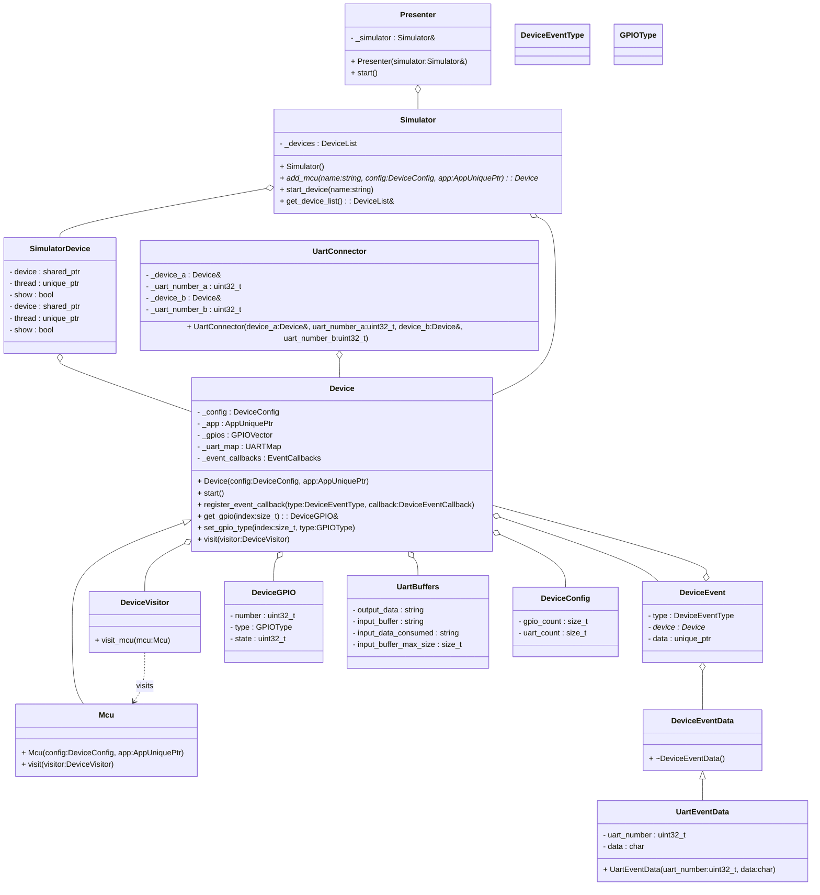

# Sabre

Sabre is a platform-independent framework for programming microcontrollers in a consistent way. The framework itself contains a few abstract classes that should be overridden by platform-dependent frameworks to implement specific APIs. By using consistent code, software designers can write software for different devices without changing too much.

## Building and testing

To build the framework, you have to use `cmake`. **Note:** CMake 3.19 or newer is required to use CMake presets. There are three CMake presets defined:

-   Debug - with tests
-   Release - with tests
-   Release - without tests

To build the project, use the following commands (replace the preset name if your configuration differs):

> **Note:** The example below uses the `ninja-release-with-tests` preset, which requires [Ninja](https://ninja-build.org/) to be installed. If you do not have Ninja or wish to use a different generator, use the appropriate preset for your setup.

```bash
cmake --preset ninja-release-with-tests
cmake --build build/release-with-tests
```

After that, you can run the tests:

```bash
## Building and testing

To build the framework, you have to use `cmake`. **Note:** CMake 3.19 or newer is required to use CMake presets. There are three CMake presets defined:

```bash
cd build/release-with-tests
ctest
```

**UML Class Diagram**

Below is an overview of the main classes in `src/sabre/sabre` and their relationships (rendered with Mermaid):

```mermaid
classDiagram
	class Factory {
		+create_uart_object(uart_number,baud,tx,rx,buffer_size)
		+create_uart_output_stream_buffer(uart_number,baud,tx,rx,buffer_size)
		+create_input_gpio(pin)
		+create_output_gpio(pin)
		+create_wifi_station()
		+create_wifi_soft_ap()
		+create_mqtt_client()
		+create_wall_clock()
		+create_ntp_client(server)
		+create_wait_for(fn,timeout,sleep)
		+create_service(fn)
	}

	class App {
		- _factory : FactoryUniquePtr
		+ App()
		+ App(factory : FactoryUniquePtr)
		+ set_factory(factory : FactoryUniquePtr)
		+ get_factory() : const FactoryUniquePtr&
		+ start()
	}

	App o-- Factory : owns

	class UART {
		+ initialize()
		+ write_byte(data : char) : int
		+ read_bytes(max_bytes : size_t, timeout_ms : uint32_t) : string
		+ flush()
		+ deinitialize()
	}

	class UARTStreamBuf {
		- _uart : UARTUniquePtr
		- _buffer : char*
		- _buffer_size : size_t
		+ UARTStreamBuf(uart:UARTUniquePtr, buffer_size=512)
		+ ~UARTStreamBuf()
	}

	class GPIO {
		- _inverse_level : bool
		+ reset()
	}

	class InputGPIO {
		- _inverse_level : bool
		+ get_level() : bool
		+ set_inverse_level(level : bool)
		+ get_inverse_level() : bool
		+ enable_pullup()
		+ enable_pulldown()
		+ disable_pullup()
		+ disable_pulldown()
		+ add_interrupt_handler(handler, trigger)
	}

	class OutputGPIO {
		+ set_high()
		+ set_low()
		+ set_level(level : bool)
	}

	class ISRConfig {
		- handler : ISRHandler
		- gpio : int
	}

	GPIO <|-- InputGPIO
	GPIO <|-- OutputGPIO
	InputGPIO ..> ISRConfig : uses

	class MQTTEvent {
		- topic : string
		- data : string
		- qos : MQTTQoS
		- retain : MQTTRetain
	}

	class MQTTTopic {
		- _client : MQTTClient&
		- _topic : string
		- _default_qos : MQTTQoS
		- _default_retain : MQTTRetain
		+ MQTTTopic(client:MQTTClient&, topic:string)
		+ publish(message:string, qos:MQTTQoS, retain:MQTTRetain)
		+ subscribe(fn:MQTTCallback, qos:MQTTQoS)
		+ set_default_qos(qos:MQTTQoS)
		+ set_default_retain(retain:MQTTRetain)
	}

	class MQTTClient {
		- _subscriptions : unordered_map<string,MQTTCallback>
		- _default_handler : MQTTCallback
		+ connect(hostname,client_id,username,password)
		+ disconnect()
		+ stop()
		+ is_connected() : bool
		+ publish(topic,message,qos,retain)
		+ subscribe(topic,fn,qos)
		+ set_default_handler(handler)
		+ process_received(event : MQTTEvent)
		+ get_topic(topic_name) : MQTTTopicUniquePtr
	}

	MQTTTopic --> MQTTClient : reference
	MQTTClient o-- MQTTTopic : returns
	MQTTClient ..> MQTTEvent : produces/consumes

	class Service {
		- _fn : ServiceHandler
		+ Service(fn : ServiceHandler)
		+ start()
		+ stop()
	}

	class WaitFor {
		- _timeout_in_ms : uint64_t
		- _fn : WaitForPred
		- _sleep_time : uint64_t
		- _result : bool
		- _runtime : uint64_t
		+ WaitFor(fn, timeout_in_ms, sleep_time)
		+ operator()() : bool
		+ get_result() : bool
		+ get_result_runtime() : uint64_t
	}

	class NTPClient {
		+ start()
		+ stop()
		+ is_synchronized() : bool
	}

	class WallClock {
		+ now_ms() : uint64_t
		+ set_now_ms(time_in_ms : uint64_t)
	}

	class WifiStation {
		+ init()
		+ connect(ssid:string, password:string)
		+ disconnect()
		+ stop()
		+ deinitialize()
		+ is_connected() : bool
		+ has_ipv4_address() : bool
	}

	class WifiSoftAP {
		+ init()
		+ start(ssid:string, password:string)
		+ stop()
		+ deinitialize()
	}

	class IPv4Address {
		- _address : uint32_t
		+ IPv4Address()
		+ IPv4Address(address:uint32_t)
		+ set(address:uint32_t)
		+ operator[](octet:uint8_t) : uint16_t
		+ operator uint32_t()
		+ operator string()
	}

	Factory ..> UART : create_uart_object()
	Factory ..> InputGPIO : create_input_gpio()
	Factory ..> OutputGPIO : create_output_gpio()
	Factory ..> WifiStation : create_wifi_station()
	Factory ..> WifiSoftAP : create_wifi_soft_ap()
	Factory ..> MQTTClient : create_mqtt_client()
	Factory ..> WallClock : create_wall_clock()
	Factory ..> NTPClient : create_ntp_client()
	Factory ..> WaitFor : create_wait_for()
	Factory ..> Service : create_service()

	class GpsDevice {
		+ get_last_position() : Position
		+ is_valid_position() : bool
		+ read() : bool
	}

	class SerialNmeaGpsDevice {
		- _uart : UARTPtr
		- _output_uart : UARTPtr
		- _nmea_validator : NMEAValidator
		- _nmea_parser : NMEA_Parser
		+ SerialNmeaGpsDevice()
		+ SerialNmeaGpsDevice(uart:UARTPtr)
		+ set_uart_ptr(uart:UARTPtr)
		+ set_output_uart_ptr(uart:UARTPtr)
		+ get_last_position() : Position
		+ is_valid_position() : bool
		+ read() : bool
	}

	GpsDevice <|-- SerialNmeaGpsDevice
	SerialNmeaGpsDevice --> UART : uses
	SerialNmeaGpsDevice ..> NMEA_Parser : composition
	GpsDevice ..> Position : returns

	class Coordinate {
		- _coordinate : double
		- _type : CoordinateType
		+ Coordinate()
		+ Coordinate(deg, min, sec, dir)
		+ Coordinate(deg, minutes, dir)
		+ Coordinate(coordinate:double, type:CoordinateType)
		+ operator==(other:Coordinate) : bool
		+ get_dd() : double
		+ get_type() : CoordinateType
		+ get_direction() : CoordinatesDirection
		+ get_degrees() : uint16_t
		+ get_minutes() : uint16_t
		+ get_seconds() : double
	}

	class Distance {
		- _distance_in_mm : uint64_t
		+ Distance()
		+ Distance(distance_in_mm:uint64_t)
		+ millimeters() : uint64_t
		+ centimeters() : float
		+ meters() : float
		+ kilometers() : float
		+ operator uint64_t()
	}

	class Position {
		- _latitude : Coordinate
		- _longitude : Coordinate
		- _version : uint32_t
		+ Position()
		+ Position(latitude:Coordinate, longitude:Coordinate)
		+ operator==(other:Position) : bool
		+ get_latitude() : Coordinate
		+ get_longitude() : Coordinate
		+ get_distance(other:Position) : Distance
		+ is_valid() : bool
		+ get_version() : uint32_t
		+ set_version(version:uint32_t)
	}

	class NMEA_Parser {
		- _last_position : Position
		- _scentences : map<string,string>
		+ NMEA_Parser()
		+ add_scentence(scentence:string)
		+ parse()
		+ get_last_position() : Position
		+ get_scentence_count() : size_t
	}

	class LogHandler {
		+ handle_log(level:LoggingLevel, logger_name:string, message:string)
	}

	class Logger {
		- _name : string
		+ Logger(name:string)
		+ log(level:LoggingLevel, message:string)
		+ debug(message:string)
		+ info(message:string)
		+ notice(message:string)
		+ warning(message:string)
		+ error(message:string)
		+ critical(message:string)
		+ alert(message:string)
		+ emergency(message:string)
	}

	class Logging {
		+ set_level(level:LoggingLevel)
		+ get_level() : LoggingLevel
		+ log(level:LoggingLevel, logger_name:string, message:string)
		+ add_handler(handler:LogHandlerSharedPtr)
		+ remove_handler(handler:LogHandlerSharedPtr)
	}

	class OStreamLogHandler {
		- _stream : ostream&
		+ OStreamLogHandler(stream:ostream&)
		+ handle_log(level:LoggingLevel, logger_name:string, s:string)
	}

	class LogBufferHandler {
		- _buffer : deque<string>
		- _max_size : size_t
		+ LogBufferHandler(size:size_t)
		+ handle_log(level:LoggingLevel, logger_name:string, message:string)
		+ get_buffer() : const deque<string>&
	}

	LogHandler <|-- OStreamLogHandler
	LogHandler <|-- LogBufferHandler
	Logging ..> LogHandler : manages
	Logger ..> Logging : uses

	WifiStation ..> IPv4Address : may expose

	%% Expanded class boxes include common methods and fields from headers.
```



> **Note**: This only tests the implementation in this repository. It does not test any platform-specific implementations. Platform-specific frameworks should provide and test their own code.


## MCU Simulator UML Class Diagram

Below is a Mermaid UML class diagram for the main classes, structs, and enums in `src/pilot/simulator`:

