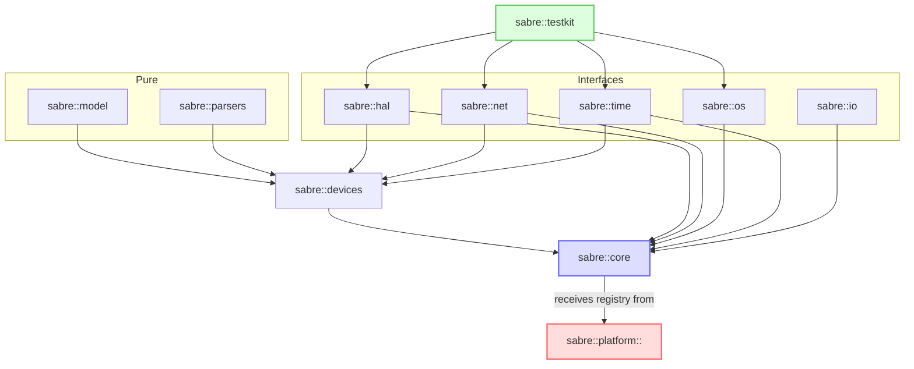

# Sabre

Sabre is a platform-independent framework for programming microcontrollers in a consistent way. The framework itself contains a few abstract classes that should be overridden by platform-dependent frameworks to implement specific APIs. By using consistent code, software designers can write software for different devices without changing too much.

## Building and testing

To build the framework, you have to use `cmake`. **Note:** CMake 3.19 or newer is required to use CMake presets. There are three CMake presets defined:

-   Debug - with tests
-   Release - with tests
-   Release - without tests

To build the project, use the following commands (replace the preset name if your configuration differs):

> **Note:** The example below uses the `ninja-release-with-tests` preset, which requires [Ninja](https://ninja-build.org/) to be installed. If you do not have Ninja or wish to use a different generator, use the appropriate preset for your setup.

```bash
cmake --preset ninja-release-with-tests
cmake --build build/release-with-tests
```

After that, you can run the tests:

```bash
## Building and testing

To build the framework, you have to use `cmake`. **Note:** CMake 3.19 or newer is required to use CMake presets. There are three CMake presets defined:

```bash
cd build/release-with-tests
ctest
```

## Namespace structure

The Sabre framework is structured as follows:

| Namespace         | Description                                                                       | Interface only |  Pure   | Dependencies                           | Remarks                       |
| ----------------- | --------------------------------------------------------------------------------- | :------------: | :-----: | -------------------------------------- | ----------------------------- |
| `sabre::core`     | Core abstractions and lifecycle                                                   |     **No**     |         | All interface only and pure namespaces | Shouldn't depend on concretes |
| `sabre::os`       | “service” concept, threading, timers; maps to FreeRTOS/Std::thread                |    **Yes**     |         | None                                   |                               |
| `sabre::hal`      | Pure hardware abstraction interfaces (GPIO, UART, I2C, SPI, etc.)                 |    **Yes**     |         | None                                   |                               |
| `sabre::net`      | Protocol-level interfaces (WiFi, SoftAP, MQTT, TCP/UDP)                           |    **Yes**     |         | None                                   |                               |
| `sabre::time`     | WallClock, NTP, monotonic timers                                                  |    **Yes**     |         | None                                   |                               |
| `sabre::io`       | Streams, logging sinks, files if any (desktop only)                               |    **Yes**     |         | None                                   |                               |
| `sabre::devices`  | High-level device facades (GPS, LTE, sensors) – use HAL underneath                |     **No**     |         | `hal`, `net`, `time`, `model`          |                               |
| `sabre::parsers`  | Parsers (NMEA, UBX, JSON...); pure, platform-free                                 |     **No**     | **Yes** | None                                   |                               |
| `sabre::model`    | Domain models (Position, SatelliteInfo…) – pure value types                       |     **No**     | **Yes** | None                                   |                               |
| `sabre::platform` | Platform modules that implement the interfaces:                                   |     **No**     |         | `hal`, `net`, `os`, `time`             |                               |
| `sabre::testkit`  | Mocks/fakes/simulators for desktop tests; implements hal/net/os with test doubles |     **No**     |         | All interface only namespaces          |                               |


| Namespace         | Description                                                                       |       Interface Only       | Allowed Dependencies                      | Forbidden Dependencies  |
| ----------------- | --------------------------------------------------------------------------------- | :------------------------: | ----------------------------------------- | ----------------------- |
| `sabre::core`     | Core abstractions and lifecycle (Registry, Application, Config, Lifecycle)        | concept, threading, timers | Yes                                       | None                    | `platform`, `core` |  | `sabre::core` | Core abstractions and lifecycle (Registry, Application, Config, Lifecycle) | No | `hal`, `net`, `os`, `time`, `io`, `model`, `parsers` | `platform`, `testkit` |
| `sabre::hal`      | Pure hardware abstraction interfaces (GPIO, UART, I2C, SPI, etc.)                 |            Yes             | None                                      | `platform`, `core`      |
| `sabre::net`      | Protocol-level interfaces (WiFi, SoftAP, MQTT, TCP/UDP)                           |            Yes             | None                                      | `platform`, `core`      |
| `sabre::time`     | WallClock, NTP, monotonic timers                                                  |            Yes             | None                                      | `platform`, `core`      |
| `sabre::io`       | Streams, logging sinks, files if any (desktop only)                               |            Yes             | None                                      | `platform`, `core`      |
| `sabre::devices`  | High-level device facades (GPS, LTE, sensors) – use HAL underneath                |             No             | `hal`, `net`, `time`, `model`             | `platform`, `core`      |
| `sabre::parsers`  | Parsers (NMEA, UBX, JSON...); pure, platform-free                                 |             No             | None                                      | `platform`, `core`      |
| `sabre::model`    | Domain models (Position, SatelliteInfo…) – pure value types                       |             No             | None                                      | `platform`, `core`      |
| `sabre::platform` | Platform modules that implement the interfaces (ESP32, STM32, Pico, Desktop)      |             No             | `hal`, `net`, `os`, `time` (to implement) | `core`, `testkit`       |
| `sabre::testkit`  | Mocks/fakes/simulators for desktop tests; implements hal/net/os with test doubles |             No             | All interface-only namespaces             | `platform`, vendor SDKs |


